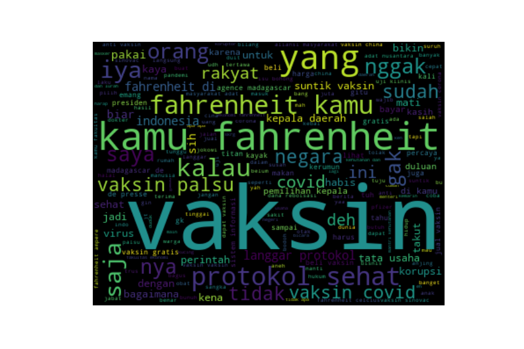
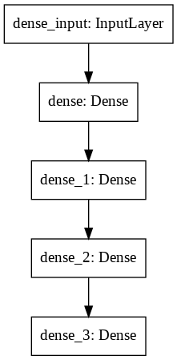

# Predictions-of-Public-Response-to-Indonesian-Government-Policies

The model aims to predict public response to government policies based on someone's tweet. The research conducted aims to build a sentiment analysis pros and cons that can be used in considering new policies. The model will accept input from Twitter users that will be grouped into two classes, namely a positive class and a negative class.

### Dataset
from crawling process by filtering Tweet on certain keywords related to government policies such as "vaccine" that related to government policies regarding vaccines.

Dataset link: https://raw.githubusercontent.com/PutriAW/Predictions-of-Public-Response-to-Indonesian-Government-Policies/main/Dataset/raw%20dataset.csv
This how the dataset looks like in wordcloud :

### Limitation
 * Indonesian language text is preferred.

### Pre Processing
  * Case Folding, The process of converting all the characters in a document into the same case
       - removal of @name [mention]
       - removal of links [https://blabala.com]
       - removal of RT
       - removal of punctuations and numbers
       - remove whitespace
       - convert text to Lowercase

  * Tokenization, the act of breaking up a sequence of strings into pieces such as words called tokens. 

  * Stopword Removal, is a step that can clean data from words that are not unique words, such as conjunctions or other adverbs.
  * Stemming is a process that can clean data from affixes, prefixes, greetings, suffixes, or combinations.
  * Slang Removal

### Modelling

#### Neural Netwok
Neural networks are forecasting methods that are based on simple mathematical models of the brain. They allow complex nonlinear relationships between the response variable and its predictors.

### our model:

 * On this project we used three data classifications SVM, MLP, NN. and NN had the best results with an accuracy of 0.756
 
| No     | Model                   | Accuracy  |
| ------ |------------------------ | ----------|
| 1      | Support Vector Machine  | 0.726158  |
| 2      | Multi-Layer Perceptron  | 0.478202  |
| 3      | Neural Networks         | 0.756131  |
